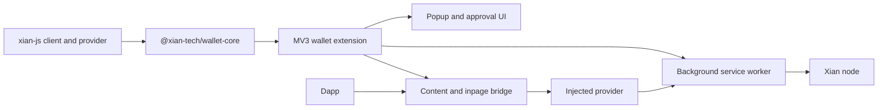

# xian-wallet-browser

`xian-wallet-browser` is the browser-wallet product workspace for Xian. It
owns the reusable wallet domain layer (`@xian-tech/wallet-core`) and the
concrete browser-extension wallet that consumes it. The official JS / TS
SDK lives in the sibling [`xian-js`](../xian-js) repo; this repo is the
*product* on top of those primitives.

## Product Shape



## Quick Start

This repo consumes `@xian-tech/client` and `@xian-tech/provider` from the
sibling `xian-js` checkout. The expected local layout is:

```text
.../xian/
  xian-js/
  xian-wallet-browser/
```

Build the SDK workspace first, then the wallet:

```bash
cd ../xian-js
npm install
npm run build

cd ../xian-wallet-browser
npm install
npm run validate
```

Browser-level wallet checks:

```bash
npx playwright install chromium
npm run test:browser --workspace xian-wallet-extension
npm run test:visual  --workspace xian-wallet-extension
```

## Product Workflows

The browser wallet has two layers:

- `@xian-tech/wallet-core` owns key material, account state, approval policy,
  durable request state, and transaction classification.
- `xian-wallet-extension` owns MV3 background / content / inpage transport,
  popup UI, approval UI, and browser storage.

Typical user-facing flows covered by this repo:

| Flow | Owned by | Notes |
| --- | --- | --- |
| Create / restore wallet | `wallet-core`, popup UI | mnemonic and private-key handling stays inside the wallet |
| Lock / unlock | `wallet-core`, extension storage | UI transport must not expose secrets while locked |
| Connect dapp | content / inpage bridge, approval UI | exposes `window.xian` / provider methods from `xian-js` |
| Sign message | provider bridge, approval UI | dapps receive only the signature |
| Prepare / sign / send tx | provider bridge, `@xian-tech/client` | dapps can send an intent without seeing private keys |
| Watch asset | provider bridge, token registry UI | lets dapps request token tracking |
| Network switching | popup UI, provider events | emits provider chain changes for connected dapps |

Load the extension locally after building:

```bash
npm run build --workspace xian-wallet-extension
```

Then open the browser extension management page, enable developer mode, and
load `apps/wallet-extension/dist` as an unpacked extension. Use a local node
from `xian-stack` or a reachable public RPC in the wallet network settings.

For dapp testing, pair it with the `xian-js` browser example:

```bash
cd ../xian-js
npm run dev --workspace example-browser-dapp
```

The extension injects the provider into pages through the same public
contract that dapps consume:

```ts
const wallet = await window.xian?.provider?.request({
  method: "xian_requestAccounts",
});
```

## Principles

- **Browser wallets are product code.** They are not SDK examples. UX,
  approvals, permissions, recovery, and storage decisions live here.
- **Provider / client contract lives in `xian-js`.** Changes to the wallet
  provider or client contract land in `xian-js` first; this repo consumes
  them.
- **Domain logic in `wallet-core`.** Custody, recovery, approvals, durable
  request state, and provider enforcement live in
  `@xian-tech/wallet-core`. They must remain transport- and UI-agnostic.
- **Extension transport and UI stay out of `wallet-core`.** MV3 background
  / content / popup transport and the wallet UI live in
  `apps/wallet-extension/`, not in the core package.
- **Independent release cadence.** `xian-js` and `xian-wallet-browser`
  release independently. Local development uses npm `overrides` to point
  at the sibling SDK; published artifacts resolve SDK deps from npm.

## Key Directories

- `packages/wallet-core/` — `@xian-tech/wallet-core`: reusable wallet
  domain logic for custody, recovery, approvals, durable request state,
  and provider enforcement.
- `apps/wallet-extension/` — the MV3 browser-extension wallet built on
  `@xian-tech/wallet-core` and the SDK packages.
- `docs/` — repo-local architecture, backlog, QA checklist, UX review,
  release notes.

## Release Model

- Releases are tag-based, `vX.Y.Z`.
- Versions are lock-stepped inside this repo, but not across all JS repos.
- Local development uses root `overrides` to consume `xian-js` from the
  sibling checkout.
- Published artifacts resolve `@xian-tech/client` and
  `@xian-tech/provider` from npm.

## Validation

```bash
npm install
npm run validate

# Browser-level coverage (Playwright)
npx playwright install chromium
npm run test:browser --workspace xian-wallet-extension
npm run test:visual  --workspace xian-wallet-extension
```

## Related Docs

- [AGENTS.md](AGENTS.md) — repo-specific guidance for AI agents and contributors
- [docs/README.md](docs/README.md) — index of internal docs
- [docs/ARCHITECTURE.md](docs/ARCHITECTURE.md) — major components and dependency direction
- [docs/BACKLOG.md](docs/BACKLOG.md) — open work and follow-ups
- [docs/RELEASING.md](docs/RELEASING.md) — tag-based release process
- [docs/QA_CHECKLIST.md](docs/QA_CHECKLIST.md) — pre-release QA checklist
- [docs/UX_REVIEW.md](docs/UX_REVIEW.md) — UX review notes
- [`../xian-js/README.md`](../xian-js/README.md) — official JS / TS SDK consumed by this repo
