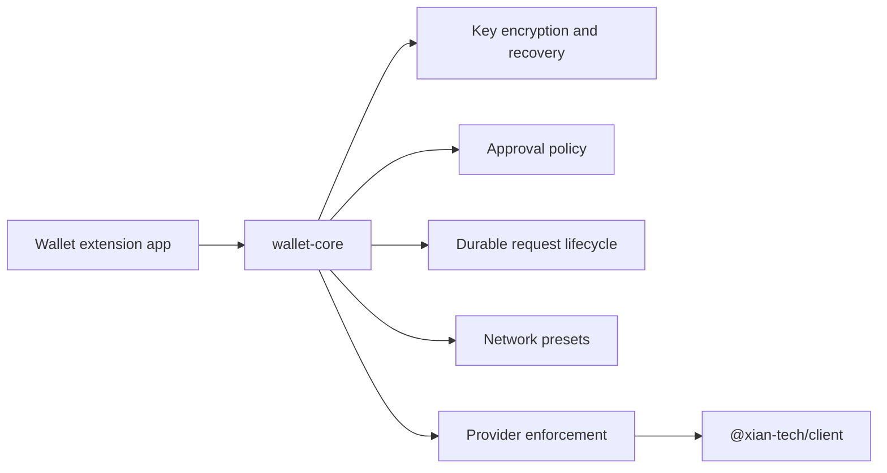

# @xian-tech/wallet-core

Reusable wallet-domain logic for Xian browser wallets.

This package lives in `xian-wallet-browser` and depends on the official
`@xian-tech/client` and `@xian-tech/provider` packages from the sibling `xian-js` repo.

It is intentionally UI-agnostic. It owns:

- wallet state models
- key encryption and recovery helpers, including BIP39-based recovery phrases
- approval rendering helpers
- the wallet controller that enforces provider permissions, approvals, durable
  request lifecycle, network-preset management, and tx flow

It does not own browser-extension transport, popup rendering, or injected-page
bridges. Those stay in app-level code such as `apps/wallet-extension/`.

